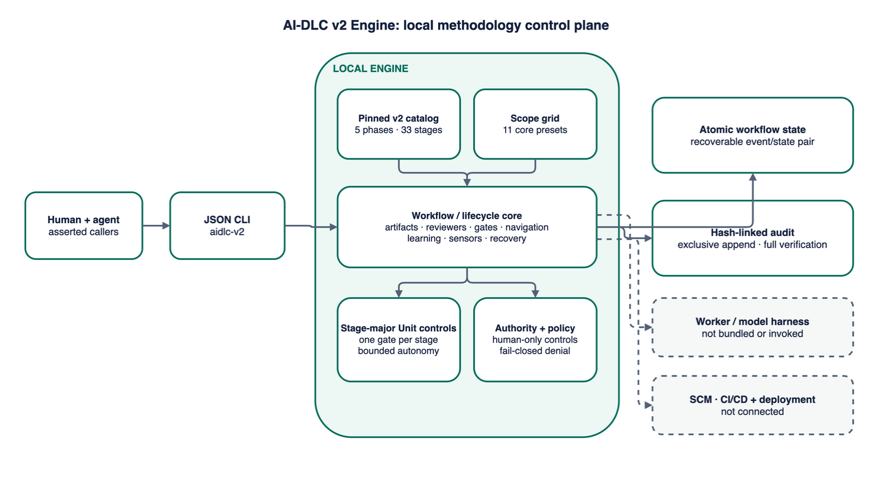

# AI-DLC v2 Engine

[](https://github.com/hk-775/aidlc-v2-engine/actions/workflows/ci.yml)
[](LICENSE)
[](pyproject.toml)

AI-DLC v2 Engine is an independent, local automation and governance engine for
the open-source AI-DLC v2 methodology. It turns the methodology’s phase,
stage, scope, artifact, approval, reviewer, Unit/Bolt, learning, and recovery
rules into deterministic state transitions with a tamper-evident audit trail.

This project is not an official AWS distribution and does not embed the
upstream TypeScript harness. Its catalog is pinned to
the official `awslabs/aidlc-workflows` `v2` branch at framework version
2.6.124 and commit `82d2e304206ca352ba3dc140dcbe8b9fb0b13b3d`, while
the Python implementation is original and licensed independently under
Apache-2.0. See
[the requirements baseline](docs/V2_REQUIREMENTS.md) and
[provenance record](docs/CLEAN_ROOM_PROVENANCE.md).

The current release is an open-source alpha for local evaluation on one POSIX
host. It is not a production authorization or deployment service.

[Project site](https://hk-775.github.io/aidlc-v2-engine/) ·
[Architecture](docs/ARCHITECTURE.md) ·
[Quickstart](QUICKSTART.md) ·
[Security](SECURITY.md) ·
[Changelog](CHANGELOG.md)

## Architecture at a glance



The local engine composes the pinned catalog and scope grid, enforces stage and
Unit/Bolt controls, and commits atomic state plus hash-linked audit events.
Worker/model harnesses and external delivery systems remain outside its
boundary.

[Open the interactive architecture explorer](site/architecture.html) or
[edit the draw.io source](site/assets/architecture.drawio).

## Implemented methodology surface

- Five phases and 33 stages from Initialization through Operation.
- Eleven core scope presets with exact execute/skip grids and independent depth and
  test-strategy defaults.
- Deterministic scope detection, the `classic` fallback, and composition
  required for ambiguous or rich freeform intent.
- Human approval for every non-initialization stage in the gated path.
- Pending, active, awaiting-approval, revising, completed, and skipped states.
- Three-strike revision handling with human-only accept-as-is.
- Guide, edit-file, and chat interaction records.
- Declared artifact outputs, upstream input checks, SHA-256 digests, safe
  locators, and a real-workspace-change assertion for Code Generation.
- Eleven domain agents, two independent reviewer agents, and reviewer loops
  capped at two iterations before final human judgment.
- Adaptive ahead-of-cursor recomposition, skip, jump, redo, park, resume, and
  completed-workflow feedback loops.
- Stage-major per-Unit Construction, one gate per Construction stage,
  zero-Unit incremental paths, walking-skeleton autonomy, and halt-and-ask
  failure handling.
- Project/team learning candidates that become effective only in a later
  workflow.
- Atomic local JSON state, recoverable pending transactions, and exclusively
  created hash-linked audit events.

## Authority boundary

Agents may register declared artifacts, answer questions, record advisory
sensors and reviewer verdicts, request gates, work under explicitly granted
Construction autonomy, and propose learning candidates.

Agents cannot approve or reject gates, change scope/depth/test strategy,
recompose or jump the workflow, set autonomy, resolve Unit/Bolt failures, promote
learning, park/resume, merge, deploy, release, accept risk, or bypass a gate.

The CLI accepts asserted identities. It does not authenticate them. External
delivery systems remain outside this engine.

## Requirements

- Python 3.11 or newer
- `uv` 0.10.7 or newer for locked development and validation
- Chrome or Chromium for the real-browser public-site check
- POSIX advisory file locking
- No runtime Python dependencies

## Run the deterministic demo

```console
git clone https://github.com/hk-775/aidlc-v2-engine.git
cd aidlc-v2-engine
uv sync --locked
uv run --locked aidlc-v2 --store .tmp/demo demo
```

The synthetic `bugfix` demo completes:

- `reverse-engineering`
- `requirements-analysis`
- `code-generation`
- `build-and-test`
- `deployment-pipeline`
- `deployment-execution`

It uses the current zero-Unit incremental path and creates 30 declared
artifacts, six human gates, and a valid 66-event audit chain. The deployment
stages record methodology evidence only; the demo performs no merge,
deployment, release, or network operation.

## Inspect the methodology

```console
uv run --locked aidlc-v2 catalog
uv run --locked aidlc-v2 detect-scope --description "Patch a CVE in the parser"
```

Initialize a separate workflow:

```console
uv run --locked aidlc-v2 \
  --store .tmp/manual \
  init \
  --name "Parser repair" \
  --description "Fix a deterministic parser bug" \
  --workspace-kind brownfield \
  --scope bugfix \
  --actor-id human_owner \
  --actor-kind human \
  --role workflow_owner
```

Every successful command emits JSON with `"ok": true`. Expected failures emit
stable error codes and return a nonzero exit status. See
[QUICKSTART.md](QUICKSTART.md) for a complete command tour.

## Local storage

```text
state.json
policy.json
audit/
  00000001-event_....json
.aidlc-v2.lock
```

A short-lived `.aidlc-v2.pending.json` may appear during a mutation. The next
locked operation verifies and finishes a valid pending event/state pair before
reading the workflow.

Audit files are created exclusively and never updated by the engine. Their
canonical hash chain detects later modification, deletion, insertion, or
reordering, and the final event binds the current state content. This is
tamper-evident, not tamper-proof or cryptographically authored.

## Repository layout

```text
src/aidlc_v2_engine/  catalog, lifecycle, policy, persistence, audit, CLI
tests/                standard-library unit and integration tests
schemas/              policy, state, and audit JSON Schemas
examples/             synthetic policy and evidence
site/                 offline static project site
tools/                safety, history, demo, package, and release checks
docs/                 product, architecture, security, and operations material
.github/               contribution templates and pinned workflows
```

## Validate the repository

```console
uv sync --locked
make test
make coverage
make scan
make history-scan
make demo
make package-check
make browser-check
```

Every Make target invokes Python through `uv run --locked`. Release archives
are built from annotated tags and verified before upload. The workflow does
not publish to a package index.

## Current limitations

- One local workflow per storage directory.
- POSIX-only locking; Windows is not supported.
- Caller identity and roles are asserted, not authenticated.
- No remote API, database, multi-host coordination, or high availability.
- Artifact content is external; the engine stores metadata and digests only.
- The workspace-change field is a caller assertion, not a source-control proof.
- Sensor results are recorded, not executed by arbitrary plugins.
- Rule files are modeled as learning records; no external rule compiler is
  bundled.
- Plugin installation, dynamic plugin scopes, multi-repository spaces,
  three-role ensembles, and worktree swarm execution remain outside this
  independent control plane.
- Audit integrity has no signature, trusted timestamp, or external anchor.
- No external delivery action is implemented.

See [production readiness](docs/PRODUCTION_READINESS.md) for the blocking
ledger.

## Contributing and license

Contributions are welcome under [CONTRIBUTING.md](CONTRIBUTING.md),
[CODE_OF_CONDUCT.md](CODE_OF_CONDUCT.md), and [GOVERNANCE.md](GOVERNANCE.md).

The engine code and original project materials are licensed under Apache-2.0.
The bounded methodology catalog is derived from the MIT-0 licensed upstream
branch pin identified in [THIRD_PARTY_NOTICES.md](THIRD_PARTY_NOTICES.md).
